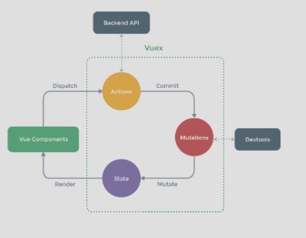

# vuex
> Vuex：Vuex 是一个专为 Vue.js 应用程序开发的状态管理模式。它采用集中式存储管理应用的所有组件的状态，并以相应的规则保证状态以一种可预测的方式发生变化。

### vue自管理应用包含的几个部分
1. state，驱动应用的数据源
2. view，以声明方式将state映射到视图
3. actions，响应再view上的用户输入导致的状态变化
4. 以下是一个‘单项数据流理念’的示意图
    

5. 多个视图依赖于同一个状态
6. 来自不同视图的行为需要变更同一状态
> 导致的问题：
    - 当我们的应用遇到多个组件共享状态时，单向数据流的简洁性很容易被破坏；
    - 问题一，传参的方法对于多层嵌套的组件将会非常繁琐，并且对于兄弟组件间的状态传递无能为力
    - 问题二，我们经常会采用父子组件直接引用或者通过事件来变更和同步状态的多份拷贝。以上的这些模式非常脆弱，通常会导致无法维护的代码。
     
### 解决的方案：vuex
1. 把组件的共享状态抽取出来，以一个全局单例模式管理
2. 在这种模式下，我们的组件树构成了一个巨大的“视图”，不管在树的哪个位置，任何组件都能获取状态或者触发行为
3. 通过定义和隔离状态管理中的各种概念并强制遵守一定的规则，我们的代码将会变得更结构化且易维护
4. vuex 示意图：

### vuex的使用情况
1. 适用于中大型单页应用
2. Flux 架构就像眼睛：您自会知道什么时候需要它。

